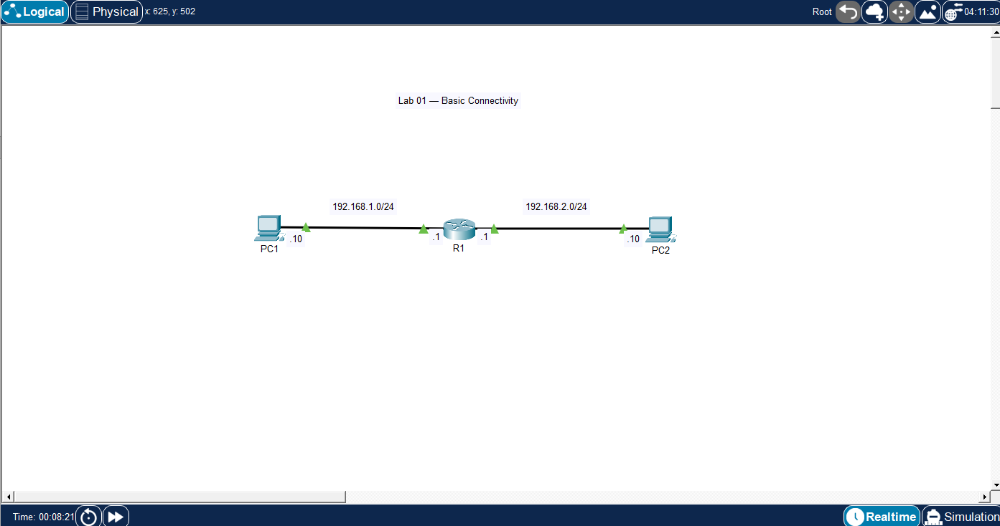

# 🧪 Lab 01 — Basic Connectivity

## 📌 Description

This lab demonstrates basic connectivity between two separate networks using a router. It focuses on IP addressing and verifying inter-network communication.

---

## 🎯 Objective

* Configure IP addressing on end devices and router interfaces
* Enable router interfaces
* Verify connectivity between PC1 and PC2


## 🖼️ Topology Diagram



---

## 🌐 IP Addressing

| Device | Interface | IP Address   | Subnet Mask   |
| ------ | --------- | ------------ | ------------- |
| PC1    | NIC       | 192.168.1.10 | 255.255.255.0 |
| R1     | Gig0/0    | 192.168.1.1  | 255.255.255.0 |
| R1     | Gig0/1    | 192.168.2.1  | 255.255.255.0 |
| PC2    | NIC       | 192.168.2.10 | 255.255.255.0 |

---

## ⚙️ Configuration

### Router R1

```bash
enable
configure terminal

interface g0/0
 ip address 192.168.1.1 255.255.255.0
 no shutdown

interface g0/1
 ip address 192.168.2.1 255.255.255.0
 no shutdown
```

### PC Configuration

* PC1 Default Gateway: 192.168.1.1
* PC2 Default Gateway: 192.168.2.1

---

## ✅ Verification

* Successful ping from PC1 to PC2
* Successful ping from PC2 to PC1

Example:

```bash
ping 192.168.2.10
```

---

## 💡 Key Takeaways

* Router interfaces are administratively down by default and require `no shutdown`
* Default gateway is necessary for communication outside the local network
* Proper IP addressing ensures successful routing between networks

---

## 📂 Files

* 📄 Lab File: [Download](./lab-file.pkt)
* 🖼️ Screenshot: [View](./topology.png)

---

## 🏷️ Exam Topics Covered

* 1.1a Routers
* 1.6 IPv4 Addressing
