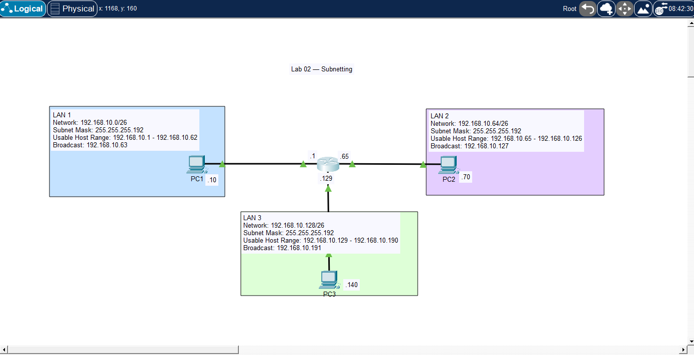

# 🧪 Lab 02 — Subnetting

## 📌 Description

This lab demonstrates how to divide a single `/24` network into multiple smaller subnets and configure routing between them using one router. It focuses on IPv4 subnetting, IP addressing, default gateways, and connectivity verification.

---

## 🎯 Objective

* Subnet `192.168.10.0/24` into smaller networks
* Configure IP addressing on router interfaces
* Configure IP addressing and default gateways on PCs
* Verify connectivity between all PCs
* Identify and fix a basic IP configuration issue

---

## 🖼️ Topology Diagram



---

## 🌐 IP Addressing

| Network | Subnet            | Subnet Mask     | Usable Host Range               | Broadcast      |
| ------- | ----------------- | --------------- | ------------------------------- | -------------- |
| LAN 1   | 192.168.10.0/26   | 255.255.255.192 | 192.168.10.1 - 192.168.10.62    | 192.168.10.63  |
| LAN 2   | 192.168.10.64/26  | 255.255.255.192 | 192.168.10.65 - 192.168.10.126  | 192.168.10.127 |
| LAN 3   | 192.168.10.128/26 | 255.255.255.192 | 192.168.10.129 - 192.168.10.190 | 192.168.10.191 |

---


## ⚙️ Configuration

### Router R1

```bash
enable
configure terminal

interface f0/0
 ip address 192.168.10.1 255.255.255.192
 no shutdown

interface f0/1
 ip address 192.168.10.65 255.255.255.192
 no shutdown

interface f0/2
 ip address 192.168.10.129 255.255.255.192
 no shutdown
```

### PC Configuration

* PC1 IP Address: 192.168.10.10
* PC1 Subnet Mask: 255.255.255.192
* PC1 Default Gateway: 192.168.10.1
* PC2 IP Address: 192.168.10.70
* PC2 Subnet Mask: 255.255.255.192
* PC2 Default Gateway: 192.168.10.65
* PC3 IP Address: 192.168.10.140
* PC3 Subnet Mask: 255.255.255.192
* PC3 Default Gateway: 192.168.10.129

---

## ✅ Verification

### Router Verification

```bash
show ip interface brief
```

* Successful ping from PC1 to PC3
* Successful ping from PC2 to PC1
* Successful ping from PC1 to PC2
* Successful ping from PC2 to PC3
* Successful ping from PC3 to PC1
* Successful ping from PC3 to PC2

Example:

```bash
ping 192.168.10.70
ping 192.168.10.140
```

---

## 💡 Key Takeaways

* A /26 subnet mask creates 4 subnets from a /24 network
* Each /26 subnet has 64 total addresses
* Each /26 subnet has 62 usable host addresses
* Devices in different subnets need a router to communicate
* A host default gateway must be in the same subnet as the host
* Wrong subnet masks or default gateways can break connectivity

---

## 📂 Files

* 📄 Lab File: [Download](./lab-file.pkt)
* 🖼️ Screenshot: [View](./topology.png)

---

## 🏷️ Exam Topics Covered

* 1.6 IPv4 Addressing
* 1.6 IPv4 Subnetting
* 1.10 Verify IP Parameters
