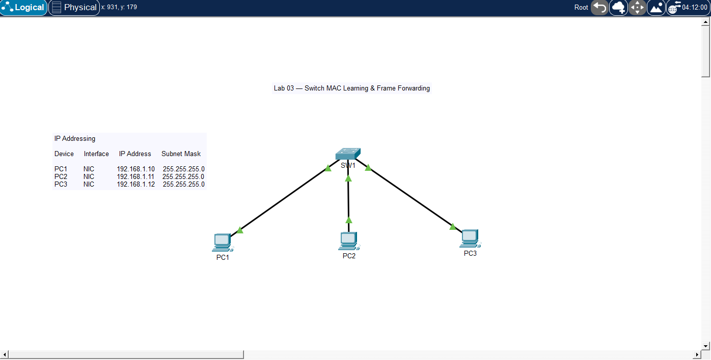

# 🧪 Lab 03 — Switch MAC Learning & Frame Forwarding

## 📌 Description

This lab demonstrates how a Layer 2 switch dynamically learns MAC addresses and forwards frames. It focuses on MAC address table population, frame flooding, and unicast forwarding behavior within a single network.

---

## 🎯 Objective

* Observe how a switch learns MAC addresses dynamically
* Verify MAC address table entries
* Understand frame flooding vs unicast forwarding
* Generate traffic to populate the MAC table
* Clear and relearn MAC addresses

---

## 🖼️ Topology Diagram



---

## 🌐 IP Addressing

| Device | Interface | IP Address   | Subnet Mask   |
| ------ | --------- | ------------ | ------------- |
| PC1    | NIC       | 192.168.1.10 | 255.255.255.0 |
| PC2    | NIC       | 192.168.1.11 | 255.255.255.0 |
| PC3    | NIC       | 192.168.1.12 | 255.255.255.0 |

---

## ⚙️ Configuration

### Switch SW1

```bash
enable
configure terminal
hostname SW1
end
write memory
```

---

### PC Configuration

* PC1 IP Address: 192.168.1.10
* PC1 Subnet Mask: 255.255.255.0
* PC2 IP Address: 192.168.1.11
* PC2 Subnet Mask: 255.255.255.0
* PC3 IP Address: 192.168.1.12
* PC3 Subnet Mask: 255.255.255.0

---

## ✅ Verification

### Step 1 — Check MAC Table (Before Traffic)

```bash
show mac address-table
```

### Step 2 — Generate Traffic

From PC1:

```bash
ping 192.168.1.11
ping 192.168.1.12
```

### Step 3 — Check MAC Table Again

```bash
show mac address-table
```

### Step 4 — Clear MAC Table and Relearn

```bash
clear mac address-table dynamic
```

Ping again and observe changes.

### Expected Results

* MAC addresses appear in the table after traffic
* Entries map correctly to switch ports
* First ping floods, subsequent traffic is unicast

---

## 🧪 Troubleshooting

* Verified switch interfaces are up using:
* show interfaces status
* Checked MAC table before and after traffic:
* show mac address-table
* Cleared MAC table to observe relearning behavior:
* clear mac address-table dynamic
* Generated traffic using ping to trigger MAC learning

---

## 💡 Key Takeaways

* Switches learn MAC addresses from incoming frames
* Unknown destination MAC = flooding
* Known destination MAC = unicast forwarding
* MAC address table entries are dynamic and age out over time
* Traffic generation is required for MAC learning

---

## 📂 Files

* 📄 Lab File: [Download](./lab-file.pkt)
* 🖼️ Screenshot: [View](./topology.png)

## 🏷️ Exam Topics Covered

* 1.13.a MAC learning
* 1.13.c Frame flooding
* 1.13.d MAC address table