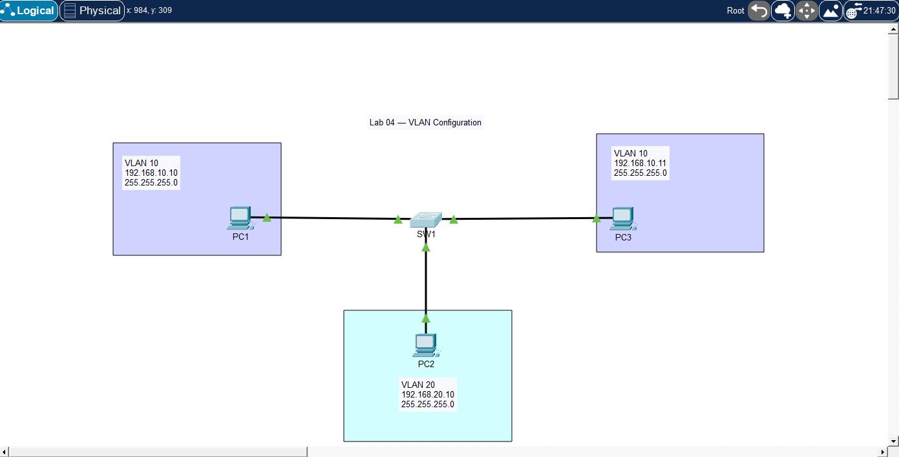

# 🧪 Lab 04 — VLAN Configuration (Single Switch)

## 📌 Description

This lab demonstrates how to configure VLANs on a Layer 2 switch and assign access ports. It focuses on network segmentation and how VLANs isolate traffic within the same physical switch.

---

## 🎯 Objective
* Create VLANs on a switch
* Assign switch ports to specific VLANs
* Verify VLAN membership
* Test communication within the same VLAN
* Observe isolation between different VLANs

---

## 🖼️ Topology Diagram



---

## 🌐 IP Addressing

| Device | VLAN   | Interface | IP Address    | Subnet Mask   |
| ------ | ------ | --------- | ------------- | ------------- |
| PC1    | VLAN10 | NIC       | 192.168.10.10 | 255.255.255.0 |
| PC2    | VLAN20 | NIC       | 192.168.20.10 | 255.255.255.0 |
| PC3    | VLAN10 | NIC       | 192.168.10.11 | 255.255.255.0 |

---

## ⚙️ Configuration

### Switch SW1

```bash
enable
configure terminal

vlan 10
 name SALES

vlan 20
 name IT

interface f0/1
 switchport mode access
 switchport access vlan 10

interface f0/2
 switchport mode access
 switchport access vlan 20

interface f0/3
 switchport mode access
 switchport access vlan 10

end
write memory
```
---

## PC Configuration
* PC1 IP Address: 192.168.10.10
* PC1 Subnet Mask: 255.255.255.0
* PC2 IP Address: 192.168.20.10
* PC2 Subnet Mask: 255.255.255.0
* PC3 IP Address: 192.168.10.11
* PC3 Subnet Mask: 255.255.255.0

---

## ✅ Verification

### Check VLANs

```bash
show vlan brief
```

### Test Connectivity

From PC1:

```bash
ping 192.168.10.11   # should work (same VLAN)
ping 192.168.20.10   # should fail (different VLAN)
```

### Expected Results

* PC1 ↔ PC3 (VLAN 10) → ✅ Success
* PC1 ↔ PC2 (Different VLANs) → ❌ Failure
* PC2 cannot communicate with VLAN 10 devices

---

## 🧪 Troubleshooting

* Verified VLAN creation:
* show vlan brief
* Checked port assignments:
* show running-config
* Ensured correct VLAN assignment on interfaces
* Tested connectivity within and across VLANs
* Verified devices are in correct IP subnets

---

## 💡 Key Takeaways
* VLANs logically separate networks on the same switch
* Devices in different VLANs cannot communicate without routing
* Access ports belong to only one VLAN
* IP addressing must match VLAN design

---

## 📂 Files

* 📄 Lab File: [Download](./lab-file.pkt)
* 🖼️ Screenshot: [View](./topology.png)

---

## 🏷️ Exam Topics Covered

* 2.1 Configure and verify VLANs
* 2.1.a Access ports
* 2.1.b Default VLAN