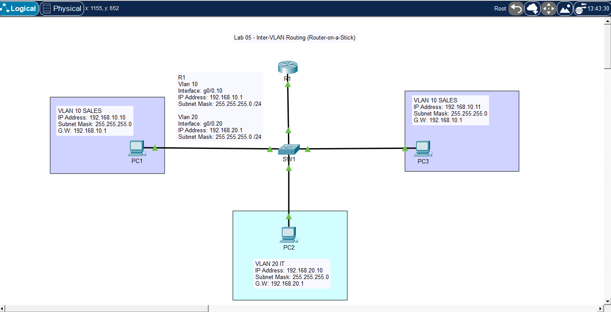

# 🧪 Lab 05 — Inter-VLAN Routing (Router-on-a-Stick)

## 📌 Description

This lab demonstrates how to enable communication between VLANs using a router-on-a-stick configuration. It focuses on trunking, router subinterfaces, and inter-VLAN routing.

---

## 🎯 Objective

* Configure VLANs on a switch
* Configure a trunk link between switch and router
* Configure router subinterfaces for each VLAN
* Enable communication between different VLANs
* Verify inter-VLAN connectivity

---

## 🖼️ Topology Diagram



--- 

## 🌐 IP Addressing

| Device | VLAN   | Interface | IP Address    | Subnet Mask   |
| ------ | ------ | --------- | ------------- | ------------- |
| PC1    | VLAN10 | NIC       | 192.168.10.10 | 255.255.255.0 |
| PC2    | VLAN20 | NIC       | 192.168.20.10 | 255.255.255.0 |
| PC3    | VLAN10 | NIC       | 192.168.10.11 | 255.255.255.0 |
| R1     | VLAN10 | g0/0.10   | 192.168.10.1  | 255.255.255.0 |
| R1     | VLAN20 | g0/0.20   | 192.168.20.1  | 255.255.255.0 |

---

## ⚙️ Configuration


### Switch SW1

```bash
enable
configure terminal

vlan 10
 name SALES

vlan 20
 name IT

interface f0/1
 switchport mode access
 switchport access vlan 10

interface f0/2
 switchport mode access
 switchport access vlan 20

interface f0/3
 switchport mode access
 switchport access vlan 10

interface g0/1
 switchport mode trunk

end
write memory
```
---

## Router R1
```bash
enable
configure terminal

interface g0/0
 no shutdown

interface g0/0.10
 encapsulation dot1Q 10
 ip address 192.168.10.1 255.255.255.0

interface g0/0.20
 encapsulation dot1Q 20
 ip address 192.168.20.1 255.255.255.0

end
write memory
```
---

## PC Configuration

* PC1 IP Address: 192.168.10.10
* PC1 Subnet Mask: 255.255.255.0
* PC1 Default Gateway: 192.168.10.1
* PC2 IP Address: 192.168.20.10
* PC2 Subnet Mask: 255.255.255.0
* PC2 Default Gateway: 192.168.20.1
* PC3 IP Address: 192.168.10.11
* PC3 Subnet Mask: 255.255.255.0
* PC3 Default Gateway: 192.168.10.1

---

## ✅ Verification

### Check Trunk

```bash
show interfaces trunk
```

### Check Router Interfaces

```bash
show ip interface brief
```

### Test Connectivity

From PC1:

```bash
ping 192.168.20.10   # should now work
```

### Expected Results

* PC1 ↔ PC3 (same VLAN) → ✅ Success
* PC1 ↔ PC2 (different VLANs) → ✅ Success
* Inter-VLAN communication is now working

---

## 🧪 Troubleshooting

* Verified trunk configuration:
* show interfaces trunk
* Checked VLAN assignments:
* show vlan brief
* Verified router subinterfaces:
* show ip interface brief
* Ensured correct default gateways on PCs
* Confirmed encapsulation matches VLAN IDs

---

## 💡 Key Takeaways

* VLANs require Layer 3 routing to communicate
* Router-on-a-stick uses a single physical interface with subinterfaces
* Each VLAN maps to a subinterface with encapsulation dot1Q
* Trunk links carry multiple VLANs between switch and router
* Default gateway must point to router subinterface

---

## 📂 Files

* 📄 Lab File: [Download](./lab-file.pkt)
* 🖼️ Screenshot: [View](./topology.png)

---

## 🏷️ Exam Topics Covered

* 2.1.c InterVLAN connectivity
* 2.2.a Trunk ports
* 2.2.b 802.1Q