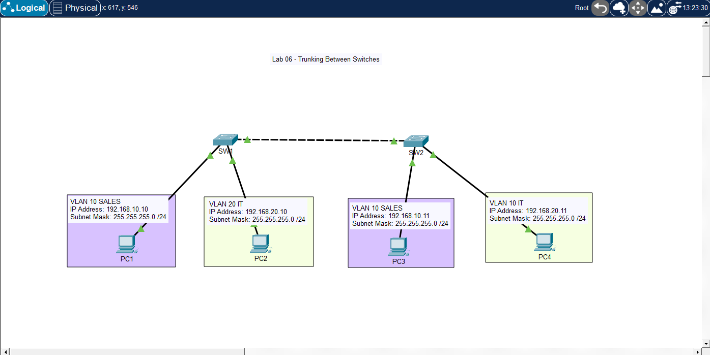

# 🧪 Lab 06 — Trunking Between Switches

## 📌 Description

This lab demonstrates how to configure trunk links between switches to allow multiple VLANs to span across them. It focuses on 802.1Q trunking and VLAN communication across multiple switches.

---

## 🎯 Objective

* Configure VLANs on multiple switches
* Configure trunk ports between switches
* Allow VLAN traffic across switches
* Verify connectivity across switches within the same VLAN
* Understand how trunking carries multiple VLANs

---

## 🖼️ Topology Diagram



---

## 🌐 IP Addressing

| Device | VLAN   | Interface | IP Address    | Subnet Mask   |
| ------ | ------ | --------- | ------------- | ------------- |
| PC1    | VLAN10 | NIC       | 192.168.10.10 | 255.255.255.0 |
| PC2    | VLAN20 | NIC       | 192.168.20.10 | 255.255.255.0 |
| PC3    | VLAN10 | NIC       | 192.168.10.11 | 255.255.255.0 |
| PC4    | VLAN20 | NIC       | 192.168.20.11 | 255.255.255.0 |

---

## ⚙️ Configuration

### Switch SW1

```bash
enable
configure terminal

vlan 10
 name SALES

vlan 20
 name IT

interface f0/1
 switchport mode access
 switchport access vlan 10

interface f0/2
 switchport mode access
 switchport access vlan 20

interface g0/1
 switchport mode trunk

end
write memory
```
---

### Switch SW2

```bash
enable
configure terminal

vlan 10
 name SALES

vlan 20
 name IT

interface f0/1
 switchport mode access
 switchport access vlan 10

interface f0/2
 switchport mode access
 switchport access vlan 20

interface g0/1
 switchport mode trunk

end
write memory
```

---

## PC Configuration

* PC1 IP Address: 192.168.10.10
* PC1 Subnet Mask: 255.255.255.0
* PC2 IP Address: 192.168.20.10
* PC2 Subnet Mask: 255.255.255.0
* PC3 IP Address: 192.168.10.11
* PC3 Subnet Mask: 255.255.255.0
* PC4 IP Address: 192.168.20.11
* PC4 Subnet Mask: 255.255.255.0

No default gateway required (Layer 2 only)

---

## ✅ Verification

### Check Trunk Status

```bash
show interfaces trunk
```

### Check VLANs

```bash
show vlan brief
```

### Test Connectivity

From PC1:

```bash
ping 192.168.10.11   # should work (same VLAN across switches)
ping 192.168.20.10   # should fail (different VLAN)
```

From PC2:

```bash
ping 192.168.20.11   # should work
```

### Expected Results

* PC1 ↔ PC3 (VLAN10 across switches) → ✅ Success
* PC2 ↔ PC4 (VLAN20 across switches) → ✅ Success
* VLAN10 ↔ VLAN20 → ❌ Failure (no routing)

---


## 🧪 Troubleshooting

* Verified trunk link:
* show interfaces trunk
* Checked VLAN existence on BOTH switches:
* show vlan brief
* Verified ports are in correct VLANs
* Confirmed trunk ports are up and not misconfigured
* Tested connectivity within same VLAN across switches

---

## 💡 Key Takeaways

* Trunk ports carry multiple VLANs over a single link
* 802.1Q tagging identifies VLAN traffic across switches
* VLANs must exist on BOTH switches to work properly
* Same VLAN = communication works across switches
* Different VLANs still require routing

---

## 📂 Files

* 📄 Lab File: [Download](./lab-file.pkt)
* 🖼️ Screenshot: [View](./topology.png)

---

## 🏷️ Exam Topics Covered
* 2.2.a Trunk ports
* 2.2.b 802.1Q
* 2.1 VLANs spanning multiple switches