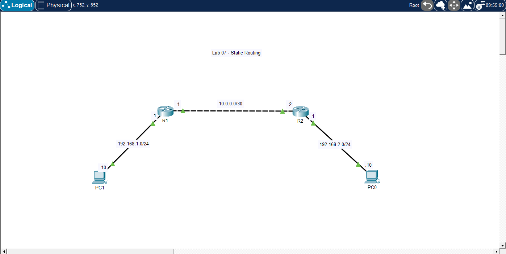

# 🧪 Lab 07 — Static Routing

## 📌 Description

This lab demonstrates how to configure static routes between multiple routers to enable communication between different networks. It focuses on manual route configuration and understanding how routers forward traffic between remote networks.

---

## 🎯 Objective

* Configure IP addressing on router interfaces
* Configure static routes between routers
* Enable communication between remote networks
* Verify routing tables
* Understand next-hop routing behavior

---

## 🖼️ Topology Diagram



--- 

## 🌐 IP Addressing

| Device | Interface | IP Address   | Subnet Mask     |
| ------ | --------- | ------------ | --------------- |
| PC1    | NIC       | 192.168.1.10 | 255.255.255.0   |
| R1     | g0/0      | 192.168.1.1  | 255.255.255.0   |
| R1     | g0/1      | 10.0.0.1     | 255.255.255.252 |
| R2     | g0/0      | 10.0.0.2     | 255.255.255.252 |
| R2     | g0/1      | 192.168.2.1  | 255.255.255.0   |
| PC2    | NIC       | 192.168.2.10 | 255.255.255.0   |

---

## ⚙️ Configuration

### Router R1

```bash
enable
configure terminal

interface g0/0
 ip address 192.168.1.1 255.255.255.0
 no shutdown

interface g0/1
 ip address 10.0.0.1 255.255.255.252
 no shutdown

ip route 192.168.2.0 255.255.255.0 10.0.0.2

end
write memory
```
---

### Router R2

```bash
enable
configure terminal

interface g0/0
 ip address 10.0.0.2 255.255.255.252
 no shutdown

interface g0/1
 ip address 192.168.2.1 255.255.255.0
 no shutdown

ip route 192.168.1.0 255.255.255.0 10.0.0.1

end
write memory
```

---

## PC Configuration

* PC1 IP Address: 192.168.1.10
* PC1 Subnet Mask: 255.255.255.0
* PC1 Default Gateway: 192.168.1.1
* PC2 IP Address: 192.168.2.10
* PC2 Subnet Mask: 255.255.255.0
* PC2 Default Gateway: 192.168.2.1

---

## ✅ Verification

### Check Routing Table

On both routers:

```bash
show ip route
```

### Test Connectivity

From PC1:

```bash
ping 192.168.2.10
```

From PC2:

```bash
ping 192.168.1.10
```

### Expected Results

* PC1 ↔ PC2 → ✅ Success
* Routers can reach each other's LAN networks
* Static routes appear in routing table (marked with S)

---

## 🧪 Troubleshooting

* Verified interfaces are up:

```bash
show ip interface brief
```

* Checked routing table:

```bash
show ip route
```
* Confirmed next-hop IP addresses are correct
* Verified PCs have correct default gateways
* Tested connectivity hop-by-hop:
* PC → Router
* Router → Router
* Router → Remote LAN

---

## 💡 Key Takeaways

* Routers do NOT automatically know remote networks
* Static routes manually define paths to remote networks
* Next-hop IP must be reachable
* Routing is required for communication between different networks
* Routing tables determine packet forwarding decisions

---

## 📂 Files

* 📄 Lab File: [Download](./lab-file.pkt)
* 🖼️ Screenshot: [View](./topology.png)

---

## 🏷️ Exam Topics Covered

* 3.3 Configure and verify IPv4 static routing
* 3.1 Routing table components
* 3.2 Router forwarding decisions