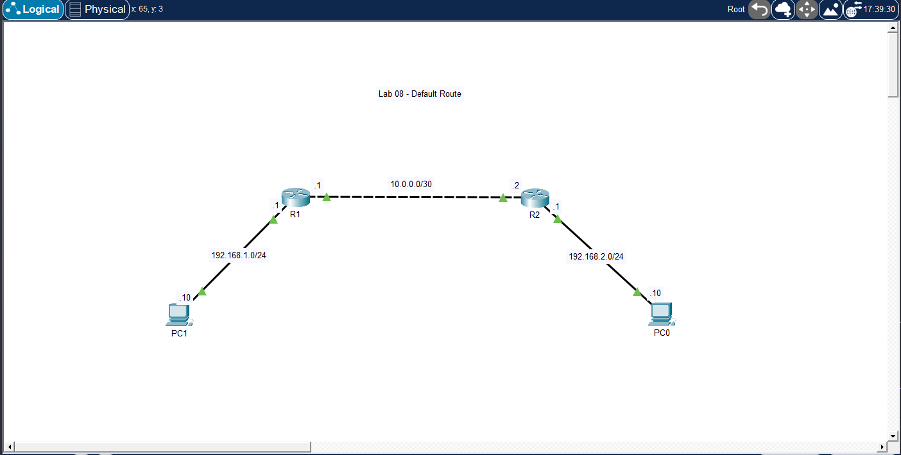

# 🧪 Lab 08 — Default Route

## 📌 Description

This lab demonstrates how to configure a default route to forward traffic to unknown destinations. It focuses on simplifying routing tables and understanding how routers handle traffic when no specific route exists.

---

## 🎯 Objective

* Configure a default route on a router
* Reduce the need for multiple static routes
* Verify routing table behavior
* Understand gateway of last resort
* Test connectivity using default routin

---

## 🖼️ Topology Diagram



--- 

## 🌐 IP Addressing

| Device | Interface | IP Address   | Subnet Mask     |
| ------ | --------- | ------------ | --------------- |
| PC1    | NIC       | 192.168.1.10 | 255.255.255.0   |
| R1     | g0/0      | 192.168.1.1  | 255.255.255.0   |
| R1     | g0/1      | 10.0.0.1     | 255.255.255.252 |
| R2     | g0/0      | 10.0.0.2     | 255.255.255.252 |
| R2     | g0/1      | 192.168.2.1  | 255.255.255.0   |
| PC2    | NIC       | 192.168.2.10 | 255.255.255.0   |

---

## ⚙️ Configuration

### Router R1

```bash
enable
configure terminal

interface g0/0
 ip address 192.168.1.1 255.255.255.0
 no shutdown

interface g0/1
 ip address 10.0.0.1 255.255.255.252
 no shutdown

# Default route (send all unknown traffic to R2)
ip route 0.0.0.0 0.0.0.0 10.0.0.2

end
write memory
```
---

### Router R2

```bash
enable
configure terminal

interface g0/0
 ip address 10.0.0.2 255.255.255.252
 no shutdown

interface g0/1
 ip address 192.168.2.1 255.255.255.0
 no shutdown

# Only one static route needed back to R1 LAN
ip route 192.168.1.0 255.255.255.0 10.0.0.1

end
write memory
```

---

## PC Configuration

* PC1 IP Address: 192.168.1.10
* PC1 Subnet Mask: 255.255.255.0
* PC1 Default Gateway: 192.168.1.1
* PC2 IP Address: 192.168.2.10
* PC2 Subnet Mask: 255.255.255.0
* PC2 Default Gateway: 192.168.2.1

---

## ✅ Verification

### Check Routing Table

```bash
show ip route
```
Look for:

* S* 0.0.0.0/0 (default route)
* “Gateway of last resort”

### Test Connectivity

From PC1:

```bash
ping 192.168.2.10
```

From PC2:

```bash
ping 192.168.1.10
```

### Expected Results

* PC1 ↔ PC2 → ✅ Success
* Default route appears in routing table
* Router forwards unknown traffic using default route

---

## 🧪 Troubleshooting

* Verified interfaces are up:

```bash
show ip interface brief
```

* Checked routing table:

```bash
show ip route
```

* Confirmed default route exists:

```bash
show running-config | include ip route
```

* Verified next-hop IP is reachable
* Tested connectivity step-by-step

---

## 💡 Key Takeaways

* Default route = gateway of last resort
* Used when no specific route matches destination
* Reduces need for multiple static routes
* Common in edge routers (toward ISP)
* Represented as 0.0.0.0/0

---

## 📂 Files

* 📄 Lab File: [Download](./lab-file.pkt)
* 🖼️ Screenshot: [View](./topology.png)

---

## 🏷️ Exam Topics Covered

* 3.3.a Default route
* 3.1.g Gateway of last resort
* 3.2 Router forwarding decisions