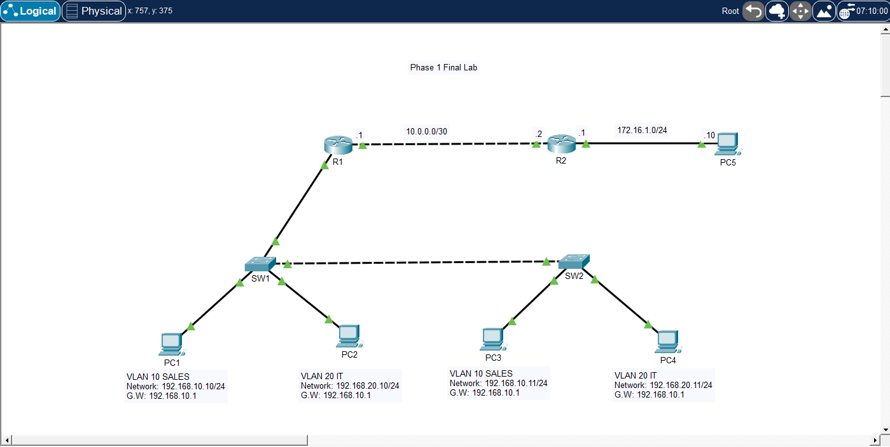

# 🧪 Phase 1 Final Lab — Multi-VLAN Enterprise Network
## 📌 Description

This lab combines all foundational networking concepts including VLANs, trunking, inter-VLAN routing, static routing, and default routing. It simulates a small enterprise network where multiple switches and routers must work together to provide full connectivity across segmented networks.

---

## 🎯 Objective

* Configure VLANs across multiple switches
* Configure trunk links between switches and router
* Implement inter-VLAN routing (router-on-a-stick)
* Configure static routing between routers
* Configure a default route
* Verify full end-to-end connectivity

---

## 🖼️ Topology Diagram



--- 

## 🌐 IP Addressing

### VLAN Networks

| Device | VLAN   | IP Address    | Subnet Mask   | Default Gateway |
| ------ | ------ | ------------- | ------------- | --------------- |
| PC1    | VLAN10 | 192.168.10.10 | 255.255.255.0 | 192.168.10.1    |
| PC3    | VLAN10 | 192.168.10.11 | 255.255.255.0 | 192.168.10.1    |
| PC2    | VLAN20 | 192.168.20.10 | 255.255.255.0 | 192.168.20.1    |
| PC4    | VLAN20 | 192.168.20.11 | 255.255.255.0 | 192.168.20.1    |

### Router Links

| Device | Interface | IP Address | Subnet Mask     |
| ------ | --------- | ---------- | --------------- |
| R1     | g0/1      | 10.0.0.1   | 255.255.255.252 |
| R2     | g0/0      | 10.0.0.2   | 255.255.255.252 |

### Remote Network

| Device | Interface | IP Address  | Subnet Mask   | Default Gateway |
| ------ | --------- | ----------- | ------------- | --------------- |
| PC5    | NIC       | 172.16.1.10 | 255.255.255.0 | 172.16.1.1      |
| R2     | g0/1      | 172.16.1.1  | 255.255.255.0 | —               |

---

## ⚙️ Configuration

### Switch SW1

```bash
enable
configure terminal

vlan 10
 name SALES

vlan 20
 name IT

interface f0/1
 switchport mode access
 switchport access vlan 10

interface f0/2
 switchport mode access
 switchport access vlan 20

# To R1
interface g0/1
 switchport mode trunk

# To SW2
 interface g0/2
 switchport mode trunk

end
write memory
```

### Switch SW2

```bash
enable
configure terminal

vlan 10
 name SALES

vlan 20
 name IT

interface f0/1
 switchport mode access
 switchport access vlan 10

interface f0/2
 switchport mode access
 switchport access vlan 20

# To SW1
interface g0/2
 switchport mode trunk

end
write memory
```

### Router R1

```bash
enable
configure terminal

interface g0/1
 no shutdown

interface g0/1.10
 encapsulation dot1Q 10
 ip address 192.168.10.1 255.255.255.0

interface g0/1.20
 encapsulation dot1Q 20
 ip address 192.168.20.1 255.255.255.0

interface g0/0
 ip address 10.0.0.1 255.255.255.252
 no shutdown

# Static route
ip route 172.16.1.0 255.255.255.0 10.0.0.2

# Default route
ip route 0.0.0.0 0.0.0.0 10.0.0.2

end
write memory
```

### Router R2

```bash
enable
configure terminal

interface g0/0
 ip address 10.0.0.2 255.255.255.252
 no shutdown

interface g0/1
 ip address 172.16.1.1 255.255.255.0
 no shutdown

# Static routes back to VLANs
ip route 192.168.10.0 255.255.255.0 10.0.0.1
ip route 192.168.20.0 255.255.255.0 10.0.0.1

end
write memory
```

---

## PC Configuration

* PC1 IP Address: 192.168.10.10
* PC1 Subnet Mask: 255.255.255.0
* PC1 Default Gateway: 192.168.10.1
* PC2 IP Address: 192.168.20.10
* PC2 Subnet Mask: 255.255.255.0
* PC2 Default Gateway: 192.168.20.1
* PC3 IP Address: 192.168.10.11
* PC3 Subnet Mask: 255.255.255.0
* PC3 Default Gateway: 192.168.10.1
* PC4 IP Address: 192.168.20.11
* PC4 Subnet Mask: 255.255.255.0
* PC4 Default Gateway: 192.168.20.1
* PC5 IP Address: 172.16.1.10
* PC5 Subnet Mask: 255.255.255.0
* PC5 Default Gateway: 172.16.1.1

---

## ✅ Verification

### Same VLAN

```bash
ping 192.168.10.11
ping 192.168.20.11
```
### Inter-VLAN

```bash
ping 192.168.20.10
```

### Across Routers

```bash
ping 172.16.1.10
```

### Router Verification

```bash
show ip route
show interfaces trunk
show vlan brief
```

---

## 🧪 Troubleshooting

* Verified VLAN configuration:
* show vlan brief
* Verified trunk links:
* show interfaces trunk
* Verified router interfaces:
* show ip interface brief
* Verified routing table:
* show ip route
* Tested connectivity step-by-step:
* Same VLAN
* Inter-VLAN
* Across routers

---

## 💡 Key Takeaways

* VLANs segment networks logically
* Trunking allows VLANs across multiple switches
* Inter-VLAN routing enables communication between VLANs
* Static routes define specific paths
* Default routes handle unknown destinations
* Routers always choose the most specific route

---

## 📂 Files

* 📄 Lab File: [Download](./lab-file.pkt)
* 🖼️ Screenshot: [View](./topology.png)

---

## 🏷️ Exam Topics Covered
* 1.13 Switching concepts
* 2.1 VLANs
* 2.2 Trunking (802.1Q)
* 2.1.c InterVLAN routing
* 3.3 Static routing
* 3.3.a Default route