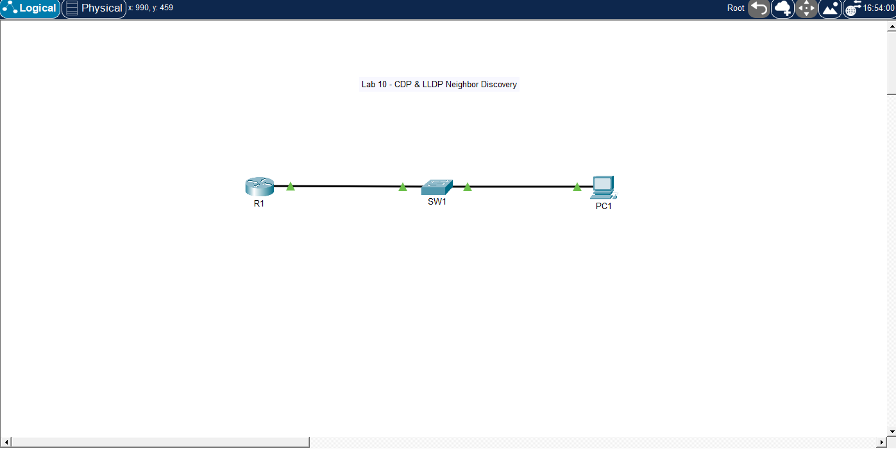

# 🧪 Lab 10 — CDP & LLDP Neighbor Discovery

## 📌 Description

This lab demonstrates how to use Cisco Discovery Protocol (CDP) and Link Layer Discovery Protocol (LLDP) to discover directly connected network devices. It focuses on identifying neighbors, interfaces, device names, and connection details without relying only on the topology diagram.


---

## 🎯 Objective

* Configure hostnames on network devices
* Verify CDP neighbor information
* Enable and verify LLDP
* Identify directly connected devices
* Use discovery protocols for troubleshooting

---

## 🖼️ Topology Diagram



--- 

## 🌐 IP Addressing

| Device | Interface | IP Address   | Subnet Mask   |
| ------ | --------- | ------------ | ------------- |
| PC1    | NIC       | 192.168.1.10 | 255.255.255.0 |
| SW1    | VLAN 1    | 192.168.1.2  | 255.255.255.0 |
| R1     | g0/0      | 192.168.1.1  | 255.255.255.0 |

---

## ⚙️ Configuration

### Router R1

```bash
enable
configure terminal

hostname R1

interface g0/0
 ip address 192.168.1.1 255.255.255.0
 no shutdown

cdp run
lldp run

end
write memory
```

### Switch SW1

```bash
enable
configure terminal

hostname SW1

interface vlan 1
 ip address 192.168.1.2 255.255.255.0
 no shutdown

ip default-gateway 192.168.1.1

cdp run
lldp run

end
write memory
```

---

## PC Configuration

* PC1 IP Address: 192.168.1.10
* PC1 Subnet Mask: 255.255.255.0
* PC1 Default Gateway: 192.168.1.1

---

## ✅ Verification

### Verify Basic Connectivity

From PC1:

```bash
ping 192.168.1.1
ping 192.168.1.2
```

### Check CDP Neighbors

On R1 and SW1:

```bash
show cdp neighbors
```

For more detail:

```bash
show cdp neighbors detail
```

### Check LLDP Neighbors

On R1 and SW1:

```bash
show lldp neighbors
```

For more detail:

```bash
show lldp neighbors detail
```

---

## Expected Results

* R1 should discover SW1 as a directly connected neighbor
* SW1 should discover R1 as a directly connected neighbor
* CDP should show device ID, local interface, platform, and port ID
* LLDP should show similar neighbor information
* PC1 will not appear as a CDP/LLDP neighbor

---

## 🧪 Troubleshooting

* Verified device hostnames:

```bash
show running-config | include hostname
```

* Verified CDP status:

```bash
show cdp
```

* Verified LLDP status:

```bash
show lldp
```

* Checked CDP neighbors:

```bash
show cdp neighbors
```

* Checked LLDP neighbors:

```bash
show lldp neighbors
```

* Verified interfaces are up:

```bash
show ip interface brief
```

---

## 💡 Key Takeaways

* CDP is Cisco proprietary
* LLDP is open standard
* Discovery protocols show directly connected network devices
* CDP and LLDP help confirm cabling and port connections
* PCs normally do not show up as CDP or LLDP neighbors
* Discovery protocols are useful for troubleshooting unknown networks

---

## 📂 Files

* 📄 Lab File: [Download](./lab-file.pkt)
* 🖼️ Screenshot: [View](./topology.png)

---

## 🏷️ Exam Topics Covered

* 2.3 Configure and verify Layer 2 discovery protocols
* 2.3 Cisco Discovery Protocol
* 2.3 LLDP