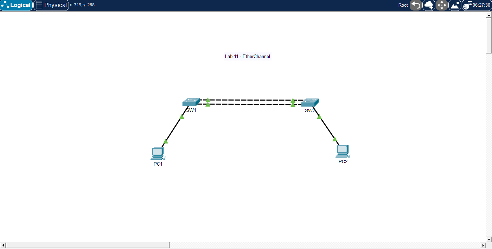

# 🧪 Lab 11 — EtherChannel with LACP

## 📌 Description

This lab demonstrates how to configure EtherChannel using LACP between two switches. It focuses on bundling multiple physical links into a single logical link for redundancy and increased bandwidth.

---

## 🎯 Objective

* Configure multiple physical links between switches
* Configure EtherChannel using LACP
* Verify Port-Channel status
* Understand active/passive LACP modes
* Test VLAN traffic across the EtherChannel trunk

---

## 🖼️ Topology Diagram



---

## 🌐 IP Addressing

| Device | VLAN   | Interface | IP Address    | Subnet Mask   |
| ------ | ------ | --------- | ------------- | ------------- |
| PC1    | VLAN10 | NIC       | 192.168.10.10 | 255.255.255.0 |
| PC2    | VLAN10 | NIC       | 192.168.10.11 | 255.255.255.0 |

---

## ⚙️ Configuration

### Switch SW1

```bash
enable
configure terminal

vlan 10
 name SALES

interface f0/1
 switchport mode access
 switchport access vlan 10

interface range g0/1 - 2
 switchport mode trunk
 channel-group 1 mode active

interface port-channel 1
 switchport mode trunk

end
write memory
```

### Switch SW2

```bash
enable
configure terminal

vlan 10
 name SALES

interface f0/1
 switchport mode access
 switchport access vlan 10

interface range g0/1 - 2
 switchport mode trunk
 channel-group 1 mode active

interface port-channel 1
 switchport mode trunk

end
write memory
```

---

## PC Configuration

*PC1 IP Address: 192.168.10.10
*PC1 Subnet Mask: 255.255.255.0
*PC2 IP Address: 192.168.10.11
*PC2 Subnet Mask: 255.255.255.0

---

## ✅ Verification

### Check EtherChannel Summary

```bash
show etherchannel summary
```

Look for:

```bash
Po1(SU)
```

Meaning:

* S = Layer 2
* U = In use

### Check Trunk Status

```bash
show interfaces trunk
```

### Test Connectivity

From PC1:

```bash
ping 192.168.10.11
```

---

### Expected Results

*Port-channel should show as Po1(SU)
*Physical links should show bundled in the port-channel
*Trunk should operate over Port-channel 1
*PC1 should successfully ping PC2

---

## 🧪 Troubleshooting

* Verified EtherChannel status:

```bash
show etherchannel summary
```

* Verified trunk configuration:

```bash
show interfaces trunk
```

* Confirmed both sides use compatible LACP mode
* Confirmed physical interfaces have matching trunk settings

---

## 💡 Key Takeaways

* EtherChannel bundles multiple links into one logical link
* LACP is the standards-based EtherChannel protocol
* active + active works
* active + passive works
* passive + passive does not form
* Member interfaces must have matching settings
* Trunking should be configured consistently on the port-channel

---

## 📂 Files

* 📄 Lab File: [Download](./lab-file.pkt)
* 🖼️ Screenshot: [View](./topology.png)

---

## 🏷️ Exam Topics Covered

* 2.4 Configure and verify EtherChannel
* 2.4 LACP
* 2.2 Trunk ports
* 2.2 802.1Q