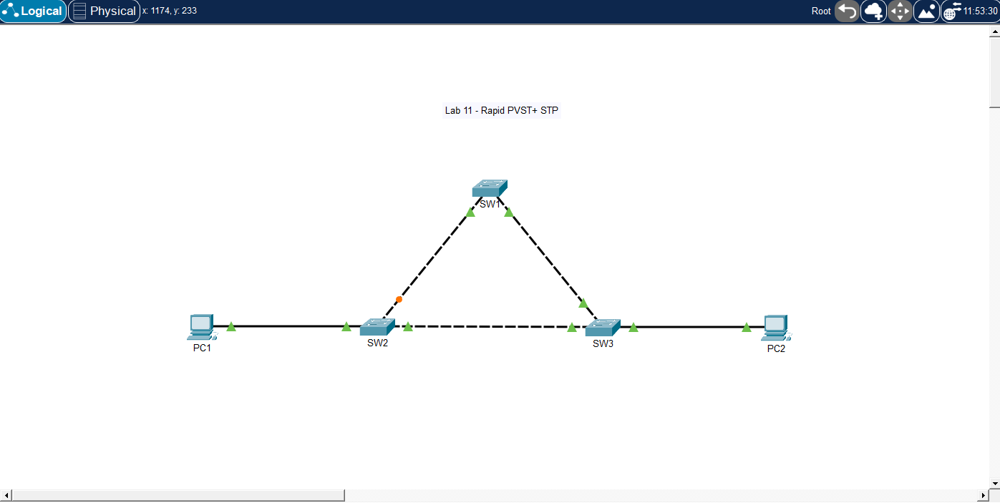

# 🧪 Lab 12 — Rapid PVST+ STP Basics

## 📌 Description

This lab demonstrates the basic operation of Rapid PVST+ Spanning Tree Protocol. It focuses on root bridge election, port roles, and loop prevention in a redundant Layer 2 topology.

---

## 🎯 Objective

* Build a redundant Layer 2 switching topology
* Observe STP root bridge election
* Identify root ports and designated ports
* Identify blocked/alternate ports
* Verify how STP prevents Layer 2 loops

---

## 🖼️ Topology Diagram



---

## 🌐 IP Addressing

| Device | VLAN   | Interface | IP Address    | Subnet Mask   |
| ------ | ------ | --------- | ------------- | ------------- |
| PC1    | VLAN10 | NIC       | 192.168.10.10 | 255.255.255.0 |
| PC2    | VLAN10 | NIC       | 192.168.10.11 | 255.255.255.0 |

---

## ⚙️ Configuration

### Switch SW1

```bash
enable
configure terminal

hostname SW1

vlan 10
 name SALES

interface range g0/1 - 2
 switchport mode trunk

spanning-tree mode rapid-pvst

end
write memory
```

### Switch SW2

```bash
enable
configure terminal

hostname SW2

vlan 10
 name SALES

interface g0/1
 switchport mode trunk

interface g0/2
 switchport mode trunk

interface f0/1
 switchport mode access
 switchport access vlan 10

spanning-tree mode rapid-pvst

end
write memory
```

### Switch SW3

```bash
enable
configure terminal

hostname SW3

vlan 10
 name SALES

interface g0/1
 switchport mode trunk

interface g0/2
 switchport mode trunk

interface f0/1
 switchport mode access
 switchport access vlan 10

spanning-tree mode rapid-pvst

end
write memory
```

---

## PC Configuration

* PC1 IP Address: 192.168.10.10
* PC1 Subnet Mask: 255.255.255.0
* PC2 IP Address: 192.168.10.11
* PC2 Subnet Mask: 255.255.255.0

---

## ✅ Verification

### Check STP Status

On all switches:

```bash
show spanning-tree
```

For VLAN 10 only:

```bash
show spanning-tree vlan 10
```

### Check Root Bridge

Look for:

* This bridge is the root

or check the Root ID section.

### Test Connectivity

From PC1:

```bash
ping 192.168.10.11
```

---

### Expected Results

*One switch becomes the root bridge
*Root bridge ports are designated forwarding ports
*Non-root switches have one root port
*One redundant path becomes alternate/blocking
*PC1 should successfully ping PC2

---

## 🧪 Troubleshooting

* Verified Rapid PVST+ mode:

```bash
show spanning-tree summary
```

* Checked STP state for VLAN 10:

```bash
show spanning-tree vlan 10
```

* Confirmed trunks are up:

```bash
show interfaces trunk
```

* Verified VLAN exists on all switches:

```bash
show vlan brief
```

Tested end-to-end connectivity between PCs

---

## 💡 Key Takeaways

*STP prevents Layer 2 loops
*The root bridge is elected using the lowest Bridge ID
*Bridge ID includes priority and MAC address
*Non-root switches choose one root port
*Redundant links may be placed into alternate/blocking state
*Rapid PVST+ runs one STP instance per VLAN

---

## 📂 Files

* 📄 Lab File: [Download](./lab-file.pkt)
* 🖼️ Screenshot: [View](./topology.png)

---

## 🏷️ Exam Topics Covered

* 2.5 Interpret Rapid PVST+ operations
* 2.5.a Root bridge
* 2.5.a Root port
* 2.5.b Port states and roles